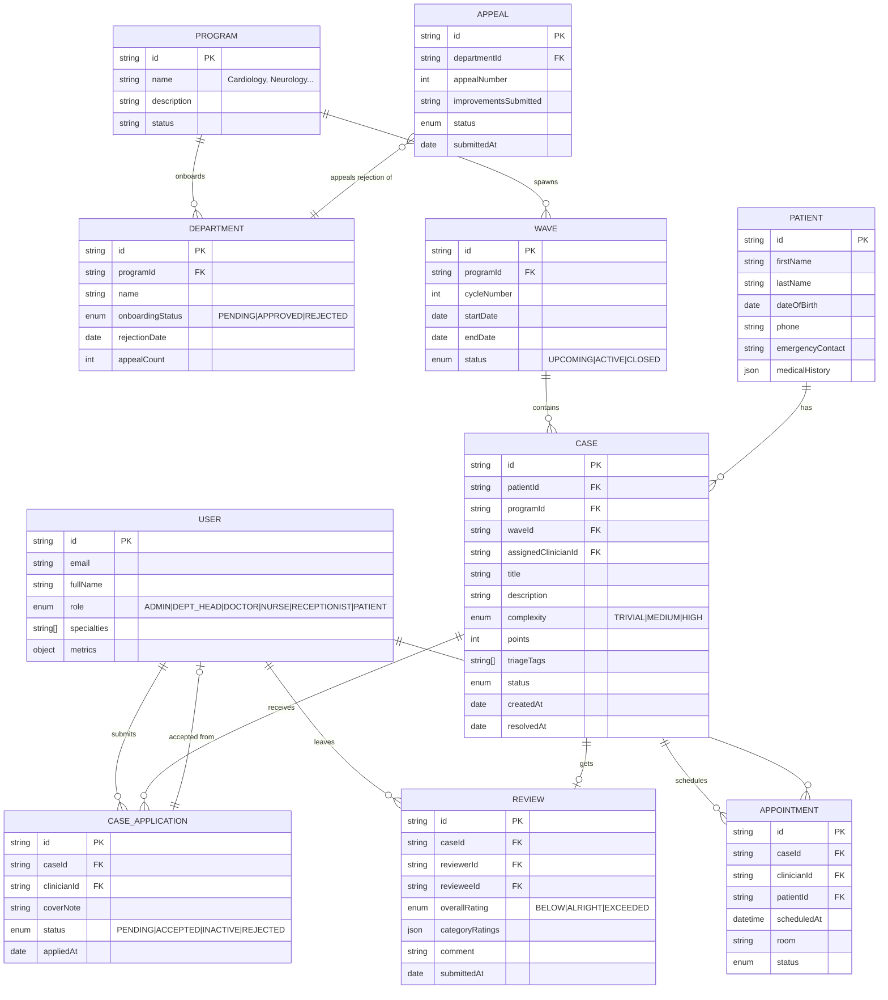

# Hospital Management System - Technical Architecture Document

## 1. Technology Stack

### 1.1 Core Frontend Stack
| Layer | Technology | Version | Rationale |
|---|---|---|---|
| Build Tool | Vite | ^5.4.x | Blazing fast HMR, optimized production builds, TypeScript first-class support |
| UI Framework | React | ^18.3.x | Component model, rich ecosystem, hooks for state & lifecycle |
| Language | TypeScript | ^5.5.x | Type safety, autocompletion, refactor confidence for large codebase |
| Routing | React Router | ^6.26.x | Declarative routing, nested routes, protected route wrappers |
| Client State | Zustand | ^4.5.x | Minimal, performant, no boilerplate compared to Redux; supports slices |
| Server State/Queries | TanStack React Query | ^5.51.x | Cache, dedupe requests, background refetch; ideal for dashboard data |
| Styling | Tailwind CSS | ^3.4.x | Utility-first, responsive design, zero-runtime, consistent tokens |
| Forms | React Hook Form | ^7.52.x | Uncontrolled, performant, minimal re-renders, Zod integration |
| Validation | Zod | ^3.23.x | Type-safe schema validation, infers TS types, composable |
| Charts | Recharts | ^2.12.x | Declarative composable charts; works natively with React components |
| Icons | Lucide React | ^0.424.x | Consistent, modern, tree-shakable icon set |
| Date Handling | date-fns | ^3.6.x | Immutable, modular, tree-shakable date utility library |
| Classnames | clsx + tailwind-merge | latest | Conditional className composition without conflicts |

### 1.2 Why No Backend?
This is a **frontend-first reference implementation**. All data is managed client-side:
- Mock data factory generates realistic seed data (patients, cases, staff, waves)
- Zustand store with `persist` middleware to localStorage for session continuity
- All "API" calls abstracted through a service layer — drop-in replaceable with REST/GraphQL later

---

## 2. Project Structure & Directory Layout

```
hospital-management-system/
├── .trae/
│   └── documents/              # PRD + Architecture docs
├── public/
│   └── favicon.svg
├── src/
│   ├── assets/
│   │   └── fonts/              # Fraunces + Plus Jakarta Sans
│   ├── components/
│   │   ├── layout/             # AppLayout, Sidebar, TopBar, Breadcrumbs
│   │   ├── ui/                 # Reusable primitives (Button, Card, Badge, Modal, Input, Select, Table, Toast)
│   │   ├── dashboard/          # StatsCard, WorkloadHeatmap, CaseList, WaveCounter
│   │   ├── cases/              # CaseCard, CaseKanban, CaseTimeline, ComplexityBadge
│   │   ├── staff/              # MetricsScorecard, StaffCard, ReviewForm
│   │   └── waves/              # WaveCalendar, WaveProgressBar
│   ├── pages/
│   │   ├── auth/               # LoginPage, ForgotPasswordPage
│   │   ├── DashboardPage.tsx
│   │   ├── patients/           # PatientListPage, PatientDetailPage, PatientNewPage
│   │   ├── cases/              # CaseListPage, CaseDetailPage, CaseNewPage, CaseKanbanPage
│   │   ├── appointments/       # AppointmentCalendarPage, AppointmentNewPage
│   │   ├── staff/              # StaffListPage, StaffDetailPage, OnboardingPage, AppealsPage
│   │   ├── departments/        # ProgramListPage, ProgramDetailPage, WaveListPage, WaveDetailPage
│   │   ├── reviews/            # ReviewQueuePage, ReviewSubmitPage
│   │   └── reports/            # ReportsPage
│   ├── store/
│   │   ├── slices/
│   │   │   ├── authSlice.ts
│   │   │   ├── patientSlice.ts
│   │   │   ├── caseSlice.ts
│   │   │   ├── staffSlice.ts
│   │   │   ├── programSlice.ts
│   │   │   ├── waveSlice.ts
│   │   │   ├── appointmentSlice.ts
│   │   │   └── reviewSlice.ts
│   │   └── index.ts            # Root store composition with persist
│   ├── services/
│   │   ├── authService.ts
│   │   ├── patientService.ts
│   │   ├── caseService.ts
│   │   ├── staffService.ts
│   │   ├── programService.ts
│   │   ├── waveService.ts
│   │   ├── appointmentService.ts
│   │   └── reviewService.ts
│   ├── data/
│   │   ├── seedData.ts         # Realistic mock data generator
│   │   ├── constants.ts        # Complexity weights, review categories, role definitions
│   │   └── lookupTables.ts     # ICD-10 snippets, specialty lists, triage tags
│   ├── hooks/
│   │   ├── useAuth.ts          # Role guard, redirect unauthenticated
│   │   ├── usePermissions.ts   # RBAC permission checker hook
│   │   ├── useWaveCountdown.ts # Current wave time remaining
│   │   └── useReviewDeadline.ts# 14-day review countdown
│   ├── types/
│   │   ├── models.ts           # Core domain types: Patient, Case, Staff, Program, Wave, Appointment, Review, Appeal
│   │   ├── api.ts              # Request/response DTOs (for future backend integration)
│   │   └── enums.ts            # Role, CaseStatus, Complexity, ReviewRating string unions
│   ├── utils/
│   │   ├── points.ts           # Complexity → points calculator
│   │   ├── dates.ts            # Wave period, review deadline, cooldown computations
│   │   ├── metrics.ts          # Staff scorecard aggregators
│   │   ├── formatters.ts       # Currency, date, name, ID formatting
│   │   └── appeal.ts           # Appeal eligibility / cooldown checks
│   ├── lib/
│   │   ├── cn.ts               # clsx + tailwind-merge helper
│   │   └── toast.ts            # Sonner-based toast helpers
│   ├── App.tsx                 # Router setup, providers, layout
│   ├── main.tsx                # React root render
│   └── index.css               # Tailwind layers, custom font faces, CSS variables
├── .env                        # Vite env vars (API_URL placeholder)
├── index.html
├── package.json
├── tsconfig.json
├── tsconfig.node.json
├── vite.config.ts
├── tailwind.config.ts          # Theme tokens, color system, typography scale
├── postcss.config.js
└── eslint.config.js            # Flat ESLint config with TS + React rules
```

---

## 3. Domain Model & Entity Relationships



---

## 4. State Management Architecture

### 4.1 Zustand Store Composition
Each domain slice independently manages its state, reducers, and selectors:

```typescript
// Example slice pattern
interface CaseSlice {
  cases: Case[];
  filters: CaseFilters;
  setFilters: (f: Partial<CaseFilters>) => void;
  createCase: (input: CreateCaseInput) => void;
  assignComplexity: (id: string, complexity: Complexity) => void;
  acceptApplication: (caseId: string, applicationId: string) => void;
  resolveCase: (id: string) => void;
  rolloverUnresolvedToNextWave: (waveId: string, nextWaveId: string) => void;
}
```

### 4.2 Persistence Strategy
- `authSlice`: Persisted to localStorage (session + user profile)
- `caseSlice`, `patientSlice`, `staffSlice`, `waveSlice`, `appointmentSlice`, `reviewSlice`: All persisted
- Blacklist: `programSlice` (re-derived from constants on load)
- Storage key prefix: `hms_v1_` for future migration strategy

### 4.3 Data Lifecycle Hooks
- **Wave Cycle Trigger**: When wave end-date passes, auto-call `rolloverUnresolvedToNextWave()`
- **Review Deadline Trigger**: `useReviewDeadline` hook blocks review edits after `case.resolvedAt + 14 days`
- **Appeal Cooldown**: `appealEligibleAt = rejectionDate + 14 days`; 2nd appeal adds 30 days

---

## 5. Security & Access Control

### 5.1 Route Guards
```typescript
// RequireRole wrapper + usePermissions hook
<Route element={<RequireRole allowed={[Role.ADMIN, Role.DEPT_HEAD]} />}>
  <Route path="/onboarding" element={<OnboardingPage />} />
</Route>
```

### 5.2 Component-Level Guards
```tsx
{can(Permission.ASSIGN_CASE_COMPLEXITY) && (
  <ComplexitySelector value={caseData.complexity} onChange={update} />
)}
```

### 5.3 List & Data Scoping
- Clinician users see only: own cases, own applications, own reviews
- Dept Head sees only: own program's data
- Patient sees only: own profile, own cases, own appointments

---

## 6. Styling & Design System

### 6.1 Tailwind Theme Tokens
```typescript
// tailwind.config.ts
theme: {
  extend: {
    colors: {
      brand: {
        50: '#F0FDFA',
        500: '#0F766E',   // Primary deep teal
        600: '#0D6E66',
        700: '#0A5A54',
        900: '#063431',
      },
      urgent: '#F59E0B',  // Amber for high-complexity
      critical: '#E11D48', // Rose
      resolved: '#10B981', // Emerald
      slate: { /* neutral scale */ },
    },
    fontFamily: {
      display: ['Fraunces', 'Georgia', 'serif'],
      sans: ['"Plus Jakarta Sans"', 'system-ui', 'sans-serif'],
    },
    boxShadow: {
      'soft': '0 2px 8px -2px rgb(15 118 110 / 0.08), 0 1px 3px rgb(15 118 110 / 0.04)',
      'card': '0 8px 24px -8px rgb(15 118 110 / 0.12), 0 2px 6px rgb(15 118 110 / 0.06)',
      'lift': '0 20px 48px -16px rgb(15 118 110 / 0.18)',
    },
    backgroundImage: {
      'mesh-brand': 'radial-gradient(at 20% 20%, rgb(15 118 110 / 0.12) 0px, transparent 50%), radial-gradient(at 80% 0%, rgb(245 158 11 / 0.10) 0px, transparent 50%)',
      'grain': "url(\"data:image/svg+xml,...\")", // noise texture
    },
  }
}
```

### 6.2 CSS Variables & Layer Strategy
- `@layer base`: Reset + font-face declarations
- `@layer components`: `.btn`, `.card`, `.badge`, `.input` reusable component classes
- `@layer utilities`: Custom utility classes (`.scrollbar-thin`, `.text-balance`)

---

## 7. Points & Metrics Calculations

### 7.1 Case Points
| Complexity | Formula | Value |
|---|---|---|
| Trivial | Base | 100 |
| Medium | Base + 50 | 150 |
| High | Base + 100 | 200 |

### 7.2 Clinician Scorecard Metrics
```typescript
const computeScorecard = (staffId: string, allCases: Case[]) => {
  const myCases = allCases.filter(c => c.assignedClinicianId === staffId);
  return {
    totalResolved: myCases.filter(c => c.status === 'RESOLVED').length,
    resolutionRate: myCases.length
      ? (resolved / myCases.length) * 100
      : 0,
    avgTimeToResolutionHours: avg(/* diff(resolvedAt - assignedAt) */),
    avgPatientReviewScore: avg(/* reviews where reviewee=staffId & reviewer.role=PATIENT */),
    avgPeerReviewScore: avg(/* reviews where reviewee=staffId & reviewer.role∈{DEPT_HEAD,DOCTOR} */),
    activityScoreBin: computePercentileBin(allStaffMetrics, score), // BOTTOM_20 | MIDDLE_60 | TOP_20
  };
};
```

### 7.3 Appeal Eligibility
```typescript
const appealEligibleAt = (dept: Department) => {
  if (dept.appealCount === 0) return addDays(dept.rejectionDate, 14);
  if (dept.appealCount === 1) return addDays(dept.rejectionDate, 30);
  return null; // appealCount >= 3, blocked forever
};
```

---

## 8. Component Architecture

### 8.1 Composition Principles
- **No business logic in UI primitives** (`components/ui/` are pure presentational)
- **Smart containers in pages** → compose feature components (`components/cases/`, etc.)
- **Hooks isolate logic**: data-fetching, derived state, timers
- **Zustand selectors** with shallow equality to prevent excess re-renders

### 8.2 Key Feature Components
- **CaseKanban**: Columns = CaseStatus, drag-assignment updates state
- **WaveProgressBar**: Shows current position within wave; warns on < 48h remaining
- **MetricsScorecard**: Displays clinician stats with percentile bins highlighted
- **ReviewForm**: Enforces 14-day deadline; category ratings are optional stars; overall is required
- **AppealCard**: Shows countdown timer + disabled submit until eligible date

---

## 9. Build & Deployment

### 9.1 Build Scripts
```json
{
  "dev": "vite",
  "build": "tsc -b && vite build",
  "preview": "vite preview",
  "lint": "eslint .",
  "typecheck": "tsc --noEmit"
}
```

### 9.2 Build Verification Steps
1. `npm run typecheck` — zero TypeScript errors
2. `npm run build` — production bundle completes successfully
3. `npm run preview` — load and smoke test key routes without errors

---

## 10. Future Extensibility Hooks

| Area | Current Implementation | Future Integration Point |
|---|---|---|
| Data Layer | In-memory Zustand + localStorage | `services/*.ts` → swap for REST/GraphQL clients |
| Auth | Local JWT mock | Hook to OAuth2 / OIDC / SAML SSO |
| Outbound Notifications | In-app toast only | Extend `toast.ts` to email/SMS gateway |
| Reporting | Recharts + CSV export | Connect BI tool via API |
| Audit Log | Console.debug() | Write to structured backend log endpoint |
